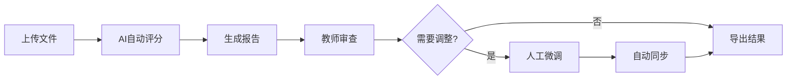

# 🎓 AI 助教智能评分与分析系统

<div align="center">

**一个基于人机协同理念的智能评分系统**

使用 AI 进行初步评分,人类教师负责监督和微调,确保评分的准确性和一致性

[快速开始](docs/QUICKSTART.md) • [使用指南](docs/USAGE.md) • [API 文档](http://localhost:8000/docs)

</div>

---

## ✨ 核心特性

- 🤖 **AI 自动评分** - 使用 GPT-4o 进行智能评分,大幅提升评分效率
- 📊 **结构化输出** - Langchain 确保评分结果格式化和可靠性
- 👨‍🏫 **人工微调** - 教师可以审查和调整 AI 的评分结果
- 🔄 **数据同步** - 报告与总分表实时同步,确保数据一致性
- 📦 **批量处理** - 支持一次性处理多个学生的作业
- 📝 **详细报告** - 为每个题目生成详细的评分依据

## 🏗️ 系统架构

```
┌─────────────────┐
│   Streamlit     │  表示层: 用户交互界面
│   (Frontend)    │
└────────┬────────┘
         │ HTTP
         ↓
┌─────────────────┐
│    FastAPI      │  应用层: 业务逻辑 + 异步任务
│   (Backend)     │
└────────┬────────┘
         │
         ↓
┌─────────────────┐
│   Langchain     │  智能层: AI 评分大脑
│  + GPT-4o       │
└─────────────────┘
```

## 📦 技术栈

- **后端**: FastAPI, Uvicorn
- **前端**: Streamlit
- **AI 引擎**: Langchain, OpenAI GPT-4o
- **数据处理**: Pydantic, Pandas
- **文件处理**: python-docx, zipfile

## 🚀 快速开始

### 1️⃣ 克隆项目

```bash
git clone <repository-url>
cd grading-copilot
```

### 2️⃣ 安装依赖

```bash
# 使用 uv (推荐)
uv pip install -e .

# 或使用 pip
pip install -e .
```

### 3️⃣ 配置环境

创建 `.env` 文件并配置 OpenAI API Key:

```bash
cp .env.example .env
# 编辑 .env 文件,填入您的 OPENAI_API_KEY
```

### 4️⃣ 启动服务

**终端 1 - 后端:**
```bash
uv run python run_api.py
```

**终端 2 - 前端:**
```bash
uv run python run_ui.py
```

### 5️⃣ 访问系统

- **前端界面**: http://localhost:8501
- **API 文档**: http://localhost:8000/docs

## 📚 使用流程

### 准备数据

1. **考试配置文件** (`exam_config.json`)
   - 定义题目、参考答案和评分标准

2. **学生答案文件** (`student_XXX.txt` 或 `.docx`)
   - 使用规范格式:
   ```
   [作答: q1]
   学生对第一题的答案...
   
   [作答: q2]
   学生对第二题的答案...
   ```

3. **打包答案** - 将所有学生答案打包成 ZIP 文件

### 评分流程



1. **上传文件** - 上传考试配置和学生答案
2. **AI 评分** - 系统自动批量评分
3. **查看结果** - 查看总分表和详细报告
4. **人工微调** - 调整不合理的评分
5. **导出数据** - 下载最终的总分表

## 🎯 核心机制

### 数据一致性保证

系统采用 **"报告为源,表格为派生"** 的设计理念:

```
┌──────────────────┐
│  评分报告 (JSON)  │  ← 单一事实来源 (SSOT)
│  每题一个文件      │
└────────┬─────────┘
         │ 动态生成
         ↓
┌──────────────────┐
│  总分表 (CSV)     │  ← 派生数据
│  自动汇总         │
└──────────────────┘
```

**工作原理:**
1. 每个题目的评分保存为独立的 JSON 报告
2. 总分表通过遍历所有报告文件动态生成
3. 修改报告后自动重新生成总分表
4. 确保数据始终保持一致,无需手动维护

### AI 评分流程

```python
# 1. 定义评分标准
scoring_criteria = [
    {"points": 4, "criterion": "正确描述核心概念"},
    {"points": 3, "criterion": "举例说明"},
    {"points": 3, "criterion": "总结归纳"}
]

# 2. AI 评分 (结构化输出)
result = grading_agent.grade(question, student_answer)
# => GradingResult(score=8.0, rationale="...")

# 3. 生成报告
report = GradingReport(
    ai_score=result.score,
    final_score=result.score,  # 初始等于 AI 评分
    ...
)

# 4. 人工微调 (可选)
report.final_score = 7.5
report.human_override_rationale = "..."

# 5. 自动同步总分表
SyncManager.on_report_updated(job_id)
```

## 📁 项目结构

```
grading-copilot/
├── src/
│   ├── models/
│   │   ├── __init__.py
│   │   └── schemas.py         # Pydantic 数据模型
│   ├── agents/
│   │   ├── __init__.py
│   │   └── grading_agent.py   # Langchain 评分代理
│   ├── api/
│   │   ├── __init__.py
│   │   ├── main.py            # FastAPI 主应用
│   │   ├── file_utils.py      # 文件处理工具
│   │   └── sync_manager.py    # 数据同步管理器
│   ├── ui/
│   │   ├── __init__.py
│   │   └── app.py             # Streamlit 前端界面
│   └── config.py              # 配置管理
├── data/
│   ├── examples/              # 示例数据
│   │   ├── exam_config.json
│   │   ├── student_1001.txt
│   │   └── student_answers.zip
│   ├── uploads/               # 上传文件存储
│   └── reports/               # 评分报告存储
├── docs/
│   ├── QUICKSTART.md          # 快速开始
│   └── USAGE.md               # 详细使用指南
├── run_api.py                 # 后端启动脚本
├── run_ui.py                  # 前端启动脚本
├── create_example_zip.py      # 创建示例ZIP
├── .env.example               # 环境变量模板
├── .gitignore
├── pyproject.toml             # 项目配置
└── README.md
```

## 🔌 API 端点

| 方法 | 端点                                                       | 说明         |
| ---- | ---------------------------------------------------------- | ------------ |
| POST | `/api/v1/jobs/start`                                       | 启动评分任务 |
| GET  | `/api/v1/jobs/{job_id}/status`                             | 查询任务状态 |
| GET  | `/api/v1/jobs/{job_id}/summary`                            | 获取总分表   |
| GET  | `/api/v1/jobs/{job_id}/students/{student_id}`              | 获取学生详情 |
| GET  | `/api/v1/jobs/{job_id}/reports/{student_id}/{question_id}` | 获取评分报告 |
| PUT  | `/api/v1/jobs/{job_id}/reports/{student_id}/{question_id}` | 更新评分报告 |

完整 API 文档: http://localhost:8000/docs

## 🧪 示例数据

项目包含完整的示例数据,可直接用于测试:

- **考试配置**: `data/examples/exam_config.json` (3道题)
- **学生答案**: `data/examples/student_1001.txt` 等 (3个学生)
- **答案压缩包**: `data/examples/student_answers.zip`

运行示例:
1. 启动系统
2. 在前端上传示例文件
3. 查看 AI 自动评分结果
4. 尝试人工微调功能

## 📖 详细文档

- [快速开始指南](docs/QUICKSTART.md) - 5分钟快速上手
- [使用手册](docs/USAGE.md) - 完整功能说明
- [API 文档](http://localhost:8000/docs) - RESTful API 参考

## ❓ 常见问题

### Q: AI 评分准确吗?

A: 系统采用多重保障措施:
- 使用 GPT-4o 模型,理解能力强
- 明确的评分标准作为唯一依据
- 结构化输出确保格式正确
- **人工审查和微调是最终保障**

### Q: 如何确保数据一致性?

A: 采用"报告为源,表格为派生"的设计:
- 报告是单一事实来源 (SSOT)
- 总分表由报告动态生成
- 修改报告后自动重新生成总分表
- 无需手动维护,确保绝对一致

### Q: 支持哪些题型?

A: 当前支持:
- 文本题 (简答题、论述题)
- 编程题 (代码评分)
- 可扩展支持多模态题目 (图片、音频等)

### Q: 能处理多少学生?

A: 采用异步处理机制:
- 后台任务处理,不阻塞界面
- 支持批量处理任意数量学生
- 实时显示评分进度

## 🤝 贡献

欢迎提交 Issue 和 Pull Request!

## 📄 许可证

MIT License

## 🙏 致谢

- [FastAPI](https://fastapi.tiangolo.com/) - 现代化的 Python Web 框架
- [Streamlit](https://streamlit.io/) - 快速构建数据应用
- [Langchain](https://langchain.com/) - LLM 应用开发框架
- [OpenAI](https://openai.com/) - GPT-4 模型支持

---

<div align="center">
Made with ❤️ for educators
</div>
