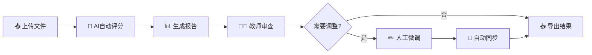

# 🎓 AI 助教智能评分与分析系统

<div align="center">

**一个基于人机协同理念的智能评分系统**

使用 AI 进行初步评分,人类教师负责监督和微调,确保评分的准确性和一致性

[快速开始](docs/QUICKSTART.md) • [使用指南](docs/USAGE.md) • [功能指南](docs/UI_FEATURES_GUIDE.md) • [部署文档](DOCKER_DEPLOY.md) • [API 文档](http://localhost:8000/docs)

</div>

---

## ✨ 核心特性

### 🎯 智能评分
- 🤖 **AI 自动评分** - 使用 GPT-4o/Qwen-Plus 等大模型进行智能评分,大幅提升评分效率
- 📊 **结构化输出** - Langchain 确保评分结果格式化和可靠性
- � **并发处理** - 批量并发评分,10倍性能提升(50道题从150秒降至15秒)
- 📦 **批量处理** - 支持 ZIP 批量上传,一次性处理多个学生作业

### �👨‍🏫 人工审核
- 🔍 **详细报告** - 为每个题目生成详细的评分依据和推理过程
- ✏️ **人工微调** - 教师可以审查和调整 AI 的评分结果,输入调整理由
- 🔄 **实时同步** - 报告与总分表实时同步,确保数据一致性
- � **可视化分析** - 交互式成绩分布图表,支持筛选和导出

### 💡 用户体验
- 🎨 **现代化界面** - 基于 Streamlit 的响应式设计,支持深色/浅色主题
- 🔌 **状态监控** - 自动检测后端服务,实时显示系统状态
- 🔍 **智能搜索** - 支持任务搜索和筛选,快速定位历史记录
- � **一键导出** - CSV/Excel 格式导出,支持单个或批量下载

## 🏗️ 系统架构

```
┌─────────────────┐
│   Streamlit     │  表示层: 用户交互界面
│   (Frontend)    │
└────────┬────────┘
         │ HTTP
         ↓
┌─────────────────┐
│    FastAPI      │  应用层: 业务逻辑 + 异步任务
│   (Backend)     │
└────────┬────────┘
         │
         ↓
┌─────────────────┐
│   Langchain     │  智能层: AI 评分大脑
│  + GPT-4o       │
└─────────────────┘
```

## 📦 技术栈

### 核心框架
- **后端框架**: FastAPI 0.115+ (高性能异步 API)
- **前端框架**: Streamlit 1.39+ (快速构建数据应用)
- **AI 引擎**: Langchain 0.3+ + OpenAI GPT-4o / Qwen-Plus
- **异步处理**: Asyncio + Uvicorn (支持并发评分)

### 数据处理
- **数据建模**: Pydantic 2.9+ (类型安全的数据验证)
- **数据分析**: Pandas 2.2+ (成绩汇总与统计)
- **可视化**: Plotly 5.18+ (交互式图表)

### 文件处理
- **文档解析**: python-docx 1.1+ (支持 .docx 格式)
- **压缩包**: zipfile (批量上传处理)
- **异步 I/O**: aiofiles 24.1+ (高效文件操作)

### 开发工具
- **依赖管理**: uv (快速的 Python 包管理器)
- **环境配置**: python-dotenv 1.0+
- **容器化**: Docker + Docker Compose (可选)

## 🚀 快速开始

### 前置要求
- Python 3.10+ 
- OpenAI API Key 或 阿里云 DashScope API Key
- (可选) Docker Desktop 20.10+

### 方式一:本地安装 (推荐开发)

#### 1️⃣ 克隆项目

```bash
git clone <repository-url>
cd grading_copilot
```

#### 2️⃣ 安装依赖

```powershell
# 使用 uv (推荐,速度更快)
uv pip install -e .

# 或使用 pip
pip install -e .
```

#### 3️⃣ 配置环境

复制环境变量模板:

```powershell
Copy-Item .env.example .env
```

编辑 `.env` 文件,配置 API Key:

```env
# OpenAI 配置
OPENAI_API_KEY=sk-your-openai-api-key-here
OPENAI_MODEL=gpt-4o

# 或使用阿里云 Qwen
# OPENAI_API_KEY=sk-your-dashscope-api-key
# OPENAI_MODEL=qwen-plus

# 服务配置
API_HOST=127.0.0.1
API_PORT=8000
STREAMLIT_PORT=8501

# 并发配置(可选)
GRADING_BATCH_SIZE=10        # 每批并发评分数量
MAX_CONCURRENT_TASKS=50      # 最大并发任务数
```

#### 4️⃣ 启动服务

**打开两个终端窗口:**

```powershell
# 终端 1 - 启动后端 API
uv run python run_api.py

# 终端 2 - 启动前端 UI
uv run python run_ui.py
```

#### 5️⃣ 访问系统

- **前端界面**: http://localhost:8501
- **API 文档**: http://localhost:8000/docs
- **健康检查**: http://localhost:8000/health

### 方式二:Docker 部署 (推荐生产)

详见 [Docker 部署指南](DOCKER_DEPLOY.md)

```powershell
# 一键启动
./docker-run.ps1 start

# 访问服务
# UI: http://localhost:8501
# API: http://localhost:8000/docs
```

## 📚 使用流程

### 📋 准备数据

#### 1. **考试配置文件** (`exam_config.json`)

定义题目、参考答案和评分标准:

```json
{
  "exam_title": "Python程序设计期中考试",
  "questions": [
    {
      "id": "q1",
      "type": "text",
      "description": "请简述Python中列表(list)和元组(tuple)的区别...",
      "max_score": 10,
      "reference_answer": "列表是可变的有序序列...",
      "scoring_criteria": [
        {"points": 3, "criterion": "正确说明列表是可变的,元组是不可变的"},
        {"points": 3, "criterion": "说明定义方式的区别"},
        {"points": 4, "criterion": "给出合理的使用场景"}
      ]
    },
    {
      "id": "q2",
      "type": "code",
      "description": "编写一个函数计算偶数平方和...",
      "max_score": 15,
      "reference_answer": "def sum_of_even_squares(nums):\n    ...",
      "scoring_criteria": [...]
    }
  ]
}
```

#### 2. **学生答案文件**

支持格式: `.txt`, `.docx`, `.md`

**标准格式**:
```
学生姓名: 张三
学号: 2024001
性别: 男

[作答: q1]
列表(list)是可变的有序序列,可以使用方括号[]定义...
元组(tuple)是不可变的...

[作答: q2]
def sum_of_even_squares(nums):
    return sum(num ** 2 for num in nums if num % 2 == 0)
```

**注意事项**:
- 学生信息(姓名、学号、性别)必须在文件开头
- 使用 `[作答: q1]` 标记分隔不同题目的答案
- 题目ID(如 `q1`)必须与配置文件中的 `id` 一致

#### 3. **批量上传**

将所有学生答案文件打包成 ZIP:
```
student_answers.zip
├── student_2024001.txt
├── student_2024002.txt
├── student_2024003.docx
└── student_2024004.md
```

### 🔄 评分流程



**详细步骤**:

1. **📤 上传文件** 
   - 上传考试配置 JSON 和学生答案 ZIP
   - 系统自动解析并验证格式

2. **🤖 AI 自动评分**
   - 并发批量评分(可配置并发数)
   - 实时显示评分进度
   - 为每道题生成详细评分报告

3. **📊 查看结果**
   - 总分表:所有学生的成绩汇总
   - 详细报告:每题的评分依据和推理过程
   - 可视化图表:成绩分布、统计分析

4. **👨‍🏫 人工审查**
   - 逐个查看学生的答案和 AI 评分
   - 检查评分是否合理,推理是否充分

5. **✏️ 人工微调** (可选)
   - 调整不合理的评分
   - 输入调整理由(建议详细说明)
   - 系统自动重新计算总分

6. **📥 导出数据**
   - 导出 CSV 格式的总分表
   - 包含学生信息、各题得分、总分
   - 可直接导入教务系统

### 💡 使用示例

项目提供完整的示例数据,位于 `data/examples/`:

- ✅ `test_exam_config.json` - 考试配置示例(4道题)
- ✅ `student_2024001.txt` ~ `student_2024005.txt` - 学生答案示例(5个学生)
- ✅ `test_student_answers.zip` - 批量上传示例

**快速测试**:
1. 启动系统
2. 上传示例文件(`test_exam_config.json` + `test_student_answers.zip`)
3. 查看 AI 自动评分结果
4. 尝试人工微调功能
5. 导出总分表

## 🎯 核心机制

### 🔄 数据一致性保证

系统采用 **"报告为源,表格为派生"** 的设计理念:

```
┌──────────────────────────┐
│  📄 评分报告 (JSON)       │  ← 单一事实来源 (SSOT)
│  每题一个文件              │     report_{student_id}_{question_id}.json
└────────┬─────────────────┘
         │ 
         │ 动态生成
         ↓
┌──────────────────────────┐
│  📊 总分表 (CSV)          │  ← 派生数据
│  遍历报告自动汇总          │     summary_table.csv
└──────────────────────────┘
```

**工作原理**:
1. ✅ 每个题目的评分保存为独立的 JSON 报告文件
2. ✅ 总分表通过遍历所有报告文件动态生成
3. ✅ 修改任何报告后自动触发重新生成总分表
4. ✅ 确保数据始终保持一致,无需手动维护同步

**优势**:
- 🎯 单一事实来源,避免数据冲突
- 🔄 自动同步,无需手动操作
- 🛡️ 数据安全,报告文件可追溯
- 🔧 易于调试,可独立检查每个报告

### 🤖 AI 评分流程

```python
# 1. 定义评分标准
scoring_criteria = [
    {"points": 4, "criterion": "正确描述核心概念"},
    {"points": 3, "criterion": "举例说明"},
    {"points": 3, "criterion": "总结归纳"}
]

# 2. AI 评分 (使用 Langchain 结构化输出)
result = await grading_agent.grade(
    question=question,
    student_answer=student_answer
)
# => GradingResult(
#      score=8.0, 
#      rationale="学生正确描述了核心概念(4分)..."
#    )

# 3. 生成评分报告
report = GradingReport(
    student_info=StudentInfo(...),
    question_id="q1",
    ai_score=result.score,
    final_score=result.score,  # 初始等于 AI 评分
    ai_rationale=result.rationale,
    ...
)

# 4. 保存报告 (单一事实来源)
save_report(job_id, report)

# 5. 人工微调 (可选)
report.final_score = 7.5
report.human_override_rationale = "虽然概念正确,但举例不够充分"
update_report(job_id, report)

# 6. 自动同步总分表
SyncManager.on_report_updated(job_id)
# => 自动重新生成 summary_table.csv
```

**AI 评分特点**:
- 📋 **严格遵循评分标准** - 仅根据 scoring_criteria 评分
- 🧠 **结构化输出** - Langchain 确保返回格式正确
- 📝 **详细推理过程** - 每个得分点都有明确理由
- 🎯 **一致性保证** - 相同答案获得相同评分

### ⚡ 并发处理优化

**性能对比**:

| 处理方式           | 50道题评分时间  | 性能提升   |
| ------------------ | --------------- | ---------- |
| 串行处理           | 150秒 (2.5分钟) | 基准       |
| 并发处理 (批量=10) | 15秒            | **10倍** ⚡ |

**实现原理**:
```python
# 收集所有评分任务
tasks = []
for student in students:
    for question in questions:
        task = grade_single_task(student, question)
        tasks.append(task)

# 分批并发执行
batch_size = Config.GRADING_BATCH_SIZE  # 默认 10
for i in range(0, len(tasks), batch_size):
    batch = tasks[i:i+batch_size]
    results = await asyncio.gather(*batch)  # 并发执行
    # 保存结果...
```

**配置参数** (`.env`):
- `GRADING_BATCH_SIZE=10` - 每批并发数量
- `MAX_CONCURRENT_TASKS=50` - 最大并发任务数

详见 [性能优化文档](docs/PERFORMANCE.md)

## 📁 项目结构

```
grading_copilot/
├── 📄 配置文件
│   ├── pyproject.toml          # 项目依赖和配置
│   ├── .env.example            # 环境变量模板
│   ├── docker-compose.yml      # Docker 生产环境配置
│   ├── docker-compose.dev.yml  # Docker 开发环境配置
│   └── pytest.ini              # 测试配置
│
├── 🚀 启动脚本
│   ├── run_api.py              # 后端 API 启动脚本
│   ├── run_ui.py               # 前端 UI 启动脚本
│   ├── docker-run.ps1          # Docker 一键部署脚本(Windows)
│   └── run_tests.sh/bat        # 测试运行脚本
│
├── 📦 源代码 (src/)
│   ├── config.py               # 全局配置管理
│   ├── models/
│   │   ├── __init__.py
│   │   └── schemas.py          # Pydantic 数据模型
│   │       ├── ExamConfig      # 考试配置
│   │       ├── StudentInfo     # 学生信息
│   │       ├── StudentAnswer   # 学生答案
│   │       ├── GradingReport   # 评分报告
│   │       └── SummaryTable    # 总分表
│   ├── agents/
│   │   ├── __init__.py
│   │   └── grading_agent.py    # Langchain 评分代理
│   ├── api/
│   │   ├── __init__.py
│   │   ├── main.py             # FastAPI 主应用
│   │   ├── file_utils.py       # 文件处理工具
│   │   │   ├── parse_exam_config()
│   │   │   ├── parse_student_answer()
│   │   │   └── extract_zip()
│   │   └── sync_manager.py     # 数据同步管理器
│   │       └── regenerate_summary_table()
│   └── ui/
│       ├── __init__.py
│       └── app.py              # Streamlit 前端界面
│           ├── 系统状态监控
│           ├── 任务管理
│           ├── 评分结果查看
│           └── 人工微调界面
│
├── 📊 数据目录 (data/)
│   ├── examples/               # 示例数据
│   │   ├── test_exam_config.json
│   │   ├── student_2024001.txt ~ student_2024005.txt
│   │   └── test_student_answers.zip
│   ├── uploads/                # 上传文件存储
│   │   └── job_{job_id}/
│   │       ├── exam_config.json
│   │       └── student_answers/
│   └── reports/                # 评分报告存储
│       └── job_{job_id}/
│           ├── report_{student_id}_{question_id}.json
│           └── summary_table.csv
│
├── 📚 文档 (docs/)
│   ├── QUICKSTART.md           # 快速开始指南
│   ├── USAGE.md                # 详细使用手册
│   ├── UI_FEATURES_GUIDE.md    # UI 功能指南
│   ├── PERFORMANCE.md          # 性能优化文档
│   ├── DEPLOYMENT.md           # 部署指南
│   ├── TEST_CASE_GUIDE.md      # 测试用例指南
│   └── CHANGELOG_*.md          # 变更日志
│
├── 🧪 测试 (tests/)
│   ├── unit/                   # 单元测试
│   │   ├── test_file_count.py
│   │   ├── test_extract_zip.py
│   │   └── test_task_name_format.py
│   ├── integration/            # 集成测试
│   │   ├── test_config_api.py
│   │   └── test_ui_config.py
│   └── helpers/                # 测试辅助工具
│       ├── create_test_case.py
│       └── demo_task_names.py
│
└── 🐳 Docker 文件
    ├── Dockerfile.api          # API 服务镜像
    ├── Dockerfile.ui           # UI 服务镜像
    └── DOCKER_DEPLOY.md        # Docker 部署文档
```

## 🔌 API 端点

### 任务管理
| 方法 | 端点                           | 说明               |
| ---- | ------------------------------ | ------------------ |
| POST | `/api/v1/jobs/start`           | 启动评分任务       |
| GET  | `/api/v1/jobs/{job_id}/status` | 查询任务状态和进度 |
| GET  | `/api/v1/jobs`                 | 获取所有任务列表   |

### 评分结果
| 方法 | 端点                                          | 说明                   |
| ---- | --------------------------------------------- | ---------------------- |
| GET  | `/api/v1/jobs/{job_id}/summary`               | 获取总分表(CSV)        |
| GET  | `/api/v1/jobs/{job_id}/students/{student_id}` | 获取单个学生的完整评分 |
| GET  | `/api/v1/jobs/{job_id}/config`                | 获取任务的考试配置     |

### 报告管理
| 方法 | 端点                                                       | 说明                   |
| ---- | ---------------------------------------------------------- | ---------------------- |
| GET  | `/api/v1/jobs/{job_id}/reports/{student_id}/{question_id}` | 获取单题评分报告       |
| PUT  | `/api/v1/jobs/{job_id}/reports/{student_id}/{question_id}` | 更新评分报告(人工微调) |

### 系统监控
| 方法 | 端点      | 说明             |
| ---- | --------- | ---------------- |
| GET  | `/health` | 健康检查         |
| GET  | `/docs`   | Swagger API 文档 |
| GET  | `/redoc`  | ReDoc API 文档   |

### 请求示例

#### 启动评分任务
```bash
curl -X POST "http://localhost:8000/api/v1/jobs/start" \
  -F "exam_config=@exam_config.json" \
  -F "answers_zip=@student_answers.zip"
```

#### 获取任务状态
```bash
curl "http://localhost:8000/api/v1/jobs/{job_id}/status"
```

#### 更新评分报告
```bash
curl -X PUT "http://localhost:8000/api/v1/jobs/{job_id}/reports/2024001/q1" \
  -H "Content-Type: application/json" \
  -d '{
    "final_score": 8.5,
    "human_override_rationale": "举例不够充分,扣0.5分"
  }'
```

**完整 API 文档**: http://localhost:8000/docs

## 🧪 测试

### 运行测试

```powershell
# Windows
./run_tests.bat

# Linux/Mac
./run_tests.sh

# 或直接使用 pytest
pytest tests/ -v
```

### 测试覆盖

- ✅ **单元测试** - 文件处理、数据模型、工具函数
- ✅ **集成测试** - API 端点、UI 配置、数据同步
- ✅ **功能测试** - 评分流程、报告生成、人工微调

详见 [测试指南](docs/TEST_CASE_GUIDE.md)

---

## ❓ 常见问题

### Q1: AI 评分准确吗?

**A:** 系统采用多重保障措施确保评分质量:

- ✅ **先进模型** - 使用 GPT-4o 或 Qwen-Plus,理解能力强
- ✅ **明确标准** - 严格遵循 scoring_criteria 评分,不主观臆断
- ✅ **结构化输出** - Langchain 确保返回格式正确,避免解析错误
- ✅ **详细推理** - 每个得分点都有明确理由,可追溯
- ✅ **人工监督** - **最终保障**,教师审查和微调是必要环节

**建议**: AI 评分作为初步评估,教师应当审查关键题目和边缘分数。

### Q2: 如何确保数据一致性?

**A:** 采用"报告为源,表格为派生"的设计:

- ✅ **单一事实来源** - 报告文件是唯一的数据源(SSOT)
- ✅ **自动同步** - 总分表由报告动态生成,不手动维护
- ✅ **触发机制** - 任何报告修改都会自动重新生成总分表
- ✅ **无冲突风险** - 不存在"表格和报告不一致"的情况

### Q3: 支持哪些题型?

**A:** 当前支持:

- ✅ **文本题** - 简答题、论述题、概念解释等
- ✅ **编程题** - 代码评分,支持多种编程语言
- 🔄 **扩展性** - 可扩展支持多模态题目(图片、音频、视频等)

### Q4: 能处理多少学生?

**A:** 采用异步并发处理机制:

- ✅ **后台任务** - 异步处理,不阻塞界面,用户可继续操作
- ✅ **批量并发** - 支持批量处理任意数量学生
- ✅ **实时进度** - 实时显示评分进度(已完成/总数)
- ✅ **高性能** - 50道题评分从150秒降至15秒(10倍提升)

**性能参考** (批量=10):
- 10个学生 × 5道题 = 50任务 → 约15秒
- 100个学生 × 5道题 = 500任务 → 约2.5分钟

### Q5: 如何配置 API Key?

**A:** 支持多种 AI 服务:

**OpenAI GPT-4o**:
```env
OPENAI_API_KEY=sk-your-openai-api-key
OPENAI_MODEL=gpt-4o
```

**阿里云 Qwen-Plus** (国内推荐):
```env
OPENAI_API_KEY=sk-your-dashscope-api-key
OPENAI_MODEL=qwen-plus
```

**其他模型**: 支持所有兼容 OpenAI API 的模型服务

### Q6: 如何部署到生产环境?

**A:** 推荐使用 Docker 部署:

```powershell
# 1. 配置环境变量
Copy-Item .env.example .env
# 编辑 .env 文件

# 2. 一键启动
./docker-run.ps1 start

# 3. 访问服务
# UI: http://localhost:8501
# API: http://localhost:8000
```

详见 [Docker 部署指南](DOCKER_DEPLOY.md)

### Q7: 如何贡献代码?

**A:** 欢迎贡献!

1. Fork 本仓库
2. 创建功能分支 (`git checkout -b feature/AmazingFeature`)
3. 提交更改 (`git commit -m 'Add some AmazingFeature'`)
4. 推送到分支 (`git push origin feature/AmazingFeature`)
5. 提交 Pull Request

请确保:
- ✅ 代码通过所有测试 (`pytest tests/`)
- ✅ 添加必要的测试用例
- ✅ 更新相关文档

---

## � 文档导航

| 文档                                     | 说明             | 适用人群 |
| ---------------------------------------- | ---------------- | -------- |
| [快速开始](docs/QUICKSTART.md)           | 5分钟快速上手    | 新手     |
| [使用手册](docs/USAGE.md)                | 完整功能说明     | 所有用户 |
| [UI 功能指南](docs/UI_FEATURES_GUIDE.md) | UI 界面详细说明  | 教师用户 |
| [API 文档](http://localhost:8000/docs)   | RESTful API 参考 | 开发者   |
| [Docker 部署](DOCKER_DEPLOY.md)          | 容器化部署指南   | 运维人员 |
| [性能优化](docs/PERFORMANCE.md)          | 并发处理原理     | 开发者   |
| [测试指南](docs/TEST_CASE_GUIDE.md)      | 测试用例编写     | 开发者   |

---

## 🎉 功能亮点

### 1. 智能评分引擎
- 🤖 支持 GPT-4o / Qwen-Plus 等多种大模型
- 📋 严格遵循评分标准,避免主观偏见
- 🧠 详细推理过程,每个得分点都有依据
- ⚡ 并发批量处理,10倍性能提升

### 2. 人机协同设计
- 👨‍🏫 AI 负责初步评分,教师负责监督
- ✏️ 灵活的人工微调功能
- 📊 可视化对比 AI 评分与最终评分
- 🔄 修改后自动同步总分表

### 3. 完善的数据管理
- �📄 报告为源,表格为派生,确保一致性
- 💾 所有评分记录可追溯
- 📥 一键导出 CSV 格式总分表
- 🔍 智能搜索和筛选功能

### 4. 现代化用户体验
- 🎨 响应式界面,支持深色/浅色主题
- 🔌 自动检测后端服务状态
- 📈 交互式图表可视化
- 💬 友好的错误提示和操作引导

---

## 🚧 路线图

### v0.2.0 (规划中)
- [ ] 支持多模态题目(图片、音频)
- [ ] 批量导入评分标准模板
- [ ] 评分历史版本对比
- [ ] 更多 AI 模型支持(Claude, Gemini)

### v0.3.0 (规划中)
- [ ] 学生答题分析和建议
- [ ] 题目难度自动评估
- [ ] 班级成绩趋势分析
- [ ] 导出 PDF 格式报告

### 未来计划
- [ ] Web 端在线答题系统
- [ ] 移动端 App
- [ ] 多语言支持
- [ ] 权限管理和多用户系统

---

## 📄 许可证

MIT License - 详见 [LICENSE](LICENSE) 文件

---

## 🙏 致谢

感谢以下开源项目:

- [FastAPI](https://fastapi.tiangolo.com/) - 现代化的 Python Web 框架
- [Streamlit](https://streamlit.io/) - 快速构建数据应用
- [Langchain](https://langchain.com/) - LLM 应用开发框架
- [OpenAI](https://openai.com/) - GPT-4 模型支持
- [Alibaba Cloud](https://www.aliyun.com/product/dashscope) - Qwen 系列模型

---

## 📧 联系方式

- **问题反馈**: [提交 Issue](https://github.com/yourusername/grading_copilot/issues)
- **功能建议**: [提交 Feature Request](https://github.com/yourusername/grading_copilot/issues/new)
- **讨论交流**: [Discussions](https://github.com/yourusername/grading_copilot/discussions)

---

<div align="center">

**Made with ❤️ for educators**

如果这个项目对你有帮助,请给我们一个 ⭐ Star!

</div>
